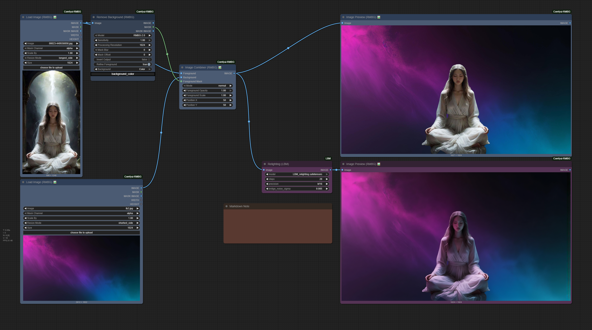
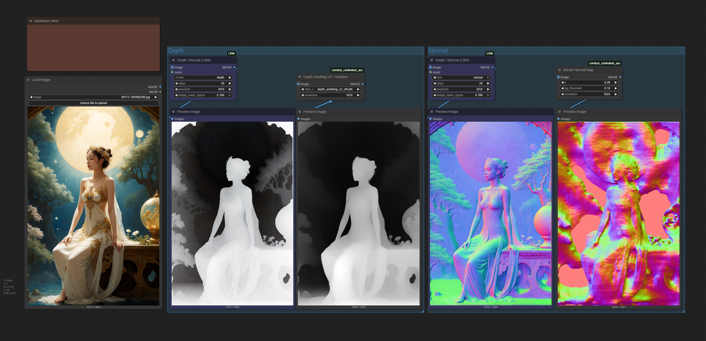

# ComfyUI-LBM

A ComfyUI implementation of Latent Bridge Matching (LBM) for efficient image relighting. This node utilizes the LBM algorithm to perform single-step image-to-image translation specifically for relighting tasks.



## News & Updates
- **2025/05/22**: Update ComfyUI-LBM to **v1.1.0** ( [update.md](https://github.com/1038lab/ComfyUI-LBM/blob/main/update.md#v110-20250522) )



## Features

- Fast image relighting with a single inference step
- Simplified workflow with just one node
- Optimized memory usage
- **Automatic model download** - the model will be downloaded automatically and properly renamed on first use
- Support for depth and normal map generation
- Mask support for selective processing
- Multiple precision options (fp32, bf16, fp16)


## Installation

1. Clone this repository to your `ComfyUI/custom_nodes` directory:
```bash
cd ComfyUI/custom_nodes
git clone https://github.com/1038lab/ComfyUI-LBM.git
```

2. Install the required dependencies:
```bash
cd ComfyUI/custom_nodes/ComfyUI-LBM
pip install -r requirements.txt
```

## Download Models

The models will be automatically downloaded and renamed on first use, or you can manually download them:

| Model | Description | Link |
| ----- | ----------- | ---- |
| LBM Relighting | Main model for image relighting | [Download](https://huggingface.co/jasperai/LBM_relighting/resolve/main/model.safetensors) |
| LBM Depth | Model for depth map generation | [Download](https://huggingface.co/jasperai/LBM_depth/resolve/main/model.safetensors) |
| LBM Normals | Model for normal map generation | [Download](https://huggingface.co/jasperai/LBM_normals/resolve/main/model.safetensors) |

After downloading, place the model files in your `ComfyUI/models/diffusion_models/LBM` directory.

## Basic Usage

### Relighting Node

1. Add the "Relighting (LBM)" node from the `🧪AILab/🔆LBM` category
2. Connect an image source to the node
3. Select the model file (defaults to `LBM_relighting.safetensors`)
4. Adjust the parameters as needed
5. Run the workflow

### Depth/Normal Node

1. Add the "Depth / Normal (LBM)" node from the `🧪AILab/🔆LBM` category
2. Connect an image source to the node
3. Select the task type (depth or normal)
4. Adjust the parameters as needed
5. Run the workflow

### Parameters

#### Relighting Node

| Parameter | Description | Default | Range |
| --------- | ----------- | ------- | ----- |
| **Model** | The LBM model file to use | `LBM_relighting.safetensors` | - |
| **Steps** | Number of inference steps | 28 | 1-100 |
| **Precision** | Inference precision | bf16 | fp32, bf16, fp16 |
| **Bridge Noise Sigma** | Controls diversity of results | 0.005 | 0.0-0.1 |

#### Depth/Normal Node

| Parameter | Description | Default | Range |
| --------- | ----------- | ------- | ----- |
| **Task** | Select task type | depth | depth, normal |
| **Steps** | Number of inference steps | 28 | 1-100 |
| **Precision** | Inference precision | bf16 | fp32, bf16, fp16 |
| **Bridge Noise Sigma** | Controls diversity of results | 0.1 | 0.0-0.1 |
| **Mask** | Optional mask for selective processing | None | - |

## Setting Tips

| Setting | Recommendation |
| ------- | -------------- |
| **Steps** | For most images, 20-30 steps provides a good balance between quality and speed |
| **Input Resolution** | The model works best with images of 512x512 or higher resolution |
| **Memory Usage** | If you encounter memory issues, try using fp16 precision or processing images at a lower resolution |
| **Performance** | For batch processing, consider reducing steps to 15-20 for faster throughput |
| **Bridge Noise Sigma** | Lower values (0.005) for relighting, higher values (0.1) for depth/normal maps |

## About Model

This implementation uses the Latent Bridge Matching (LBM) method from the paper "LBM: Latent Bridge Matching for Fast Image-to-Image Translation". The model is designed for fast image relighting, transforming the lighting of objects in an image.

LBM offers:
* Fast processing with a single inference step
* High-quality relighting effects
* Memory-efficient operation
* Consistent results across various image types
* Support for depth and normal map generation
* Mask-based selective processing

The model is trained on a diverse dataset of images with different lighting conditions, ensuring:
* Balanced representation across different image types
* High accuracy in various scenarios
* Robust performance with complex lighting

## Roadmap

Future plans for this repository include:
* LBM Depth - for depth map estimation
* LBM Normal - for normal map generation
* Additional optimization options

## Requirements

* ComfyUI
* Python 3.10+
* Required packages (automatically installed via requirements.txt):
  * torch>=2.0.0
  * torchvision>=0.15.0
  * Pillow>=9.0.0
  * numpy>=1.22.0
  * huggingface-hub>=0.19.0
  * tqdm>=4.65.0
  * diffusers>=0.19.0
  * accelerate>=0.20.0
  * transformers>=4.30.0
  * safetensors>=0.3.1
  * requests>=2.25.0

## Credits

* LBM Model: [Hugging Face Model](https://huggingface.co/jasperai/LBM_relighting)
* Original Implementation: [GitHub Repository](https://github.com/gojasper/LBM)
* Paper: "LBM: Latent Bridge Matching for Fast Image-to-Image Translation" by Clément Chadebec, Onur Tasar, Sanjeev Sreetharan, and Benjamin Aubin
* Created by: 1038lab

## License

This repository's code is released under the GNU General Public License v3.0 (GPL-3.0).

The LBM model itself is released under the Creative Commons BY-NC 4.0 license, following the original LBM implementation. Please refer to the [original repository](https://github.com/gojasper/LBM) for more details on model usage restrictions.
