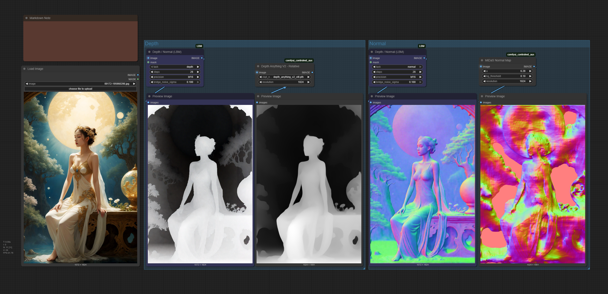

ComfyUI-LBM Update Log

v1.1.0 (2025/05/22)

## New Features
- Added Depth/Normal map generation support
  - New "Depth / Normal (LBM)" node
  - Support for both depth and normal map generation
  - Automatic model download for depth and normal models
- Added mask support for selective processing
- Added multiple precision options (fp32, bf16, fp16)
- Added bridge_noise_sigma parameter for controlling result diversity

## Improvements
- Updated model download system
  - Models now download to `ComfyUI/models/diffusion_models/LBM` directory
  - Added support for multiple model types
- Enhanced parameter control
  - Added precision selection
  - Added bridge noise sigma control
  - Updated default steps to 28 for better performance
- Improved memory management
  - Added precision options for memory optimization
  - Better model loading and unloading

## Bug Fixes
- Fixed model download path issues
- Fixed memory management in long-running processes
- Fixed precision-related issues with model loading
